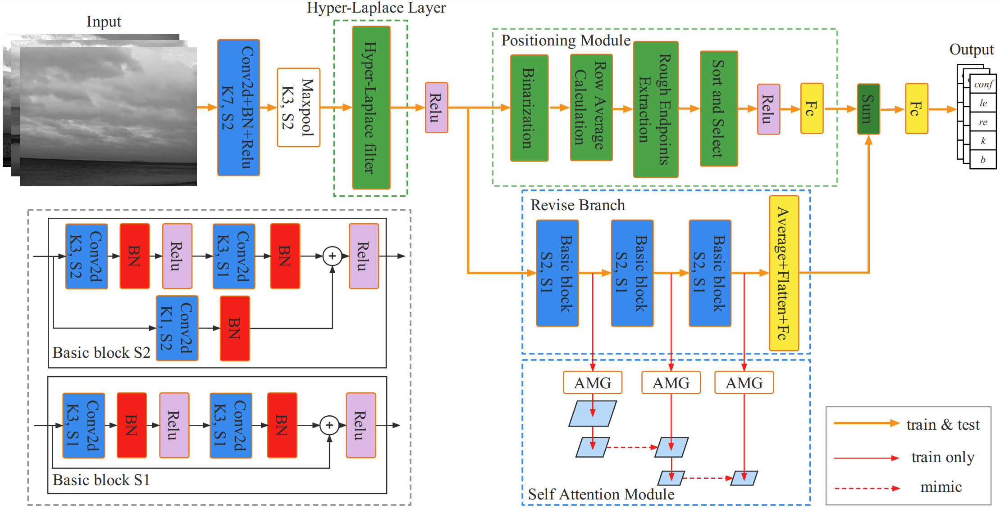

<div align="center">

# A Novel Real-Time Infrared Horizon Detection Algorithm

</div>

## About this Algorithm
The proposed algorithm is designed for horizon detection.
This code aims to reproduce the results in our paper, part of the test data is included in ./data/test_set.

The framework of the project is based on [PolyLaneNet](https://github.com/lucastabelini/PolyLaneNet) from Lucas Tabelini for Lane detection (thanks for their outstanding work),
and changes have been made according to the characteristics and application fields of horizon detection.
 
The main innovation point is that a new network structure was designed, which deeply integrate the the thoughts of traditional hand-crafted features and CNN to improve detection efficiency.

Other contributions：

(1)An HLL based on the HLF is designed and optimized specially to process the feature maps to highlight the target and eliminate the interferences simultaneously. We carefully studied the principle of the HLF and proved its effectiveness through extensive experiments.

(2)According to the structural characteristics of the multiple feature maps inside CNN, a Positioning-Module is presented, which can quickly detect the position of the horizon with acceptable additional computational cost. 

(3)By integrating the traditional idea modules deeply into CNN, the proposed strategy integrates both the intuitiveness of the traditional method and the powerful feature extraction capability of CNN. Moreover, to fully estimate the performance of the algorithm proposed in this paper, a self-built dataset named HorizonSet with more than 6000 samples that covers a variety of complex scenes is presented.

## About the datasets and trained models
All datasets were constructed according to the structure of the Tusimple dataset, for every horizon line, 13 gt points were provided.  
You could acquire the marked images by yourself with the code in ./nets/Proposed.py and test.py via the annotated lines.

Download the test set of the infrared maritime and land environments horizon detection dataset (**InfML-HDD**)  dataset [here](https://drive.google.com/file/d/1hDJVj7U90SS0jknrVwmIYLRZVFpcZ50i/view?usp=sharing), and the trained models from model_386 to model_416 could be downloaded [here](https://drive.google.com/file/d/1FGwSQpNX4mv9EUOKVBcPCoSJKTBRHpY0/view?usp=sharing), and after download, you should decompression them in **./experiments/**

In **MAR-DCT** dataset there are 3 infrared videos without ground truth labels, firstly, we extracted all frames and remove the frames that were damaged, then crop the black box around the original image and obtain 7374 frames with the size of 704 $\times$ 576 pixels, finally, we resize all these frames to 384 $\times$ 288 pixels and labeled them one by one via Labelme software. Download **MAR-DCT** dataset [here](https://drive.google.com/file/d/1zrQBrJMc381pKCg_jPEp1tqoMHHWA_Sa/view?usp=sharing), trained models [here](https://drive.google.com/file/d/1SBTqiMHEUdb8FbkSkrp-MonNfyCcmZvd/view?usp=sharing).

If you use **MAR-DCT** dataset, you can refer to the following article.
```
@inproceedings{bloisi2015argos,
  title={ARGOS-Venice boat classification},
  author={Bloisi, Domenico D and Iocchi, Luca and Pennisi, Andrea and Tombolini, Luigi},
  booktitle={2015 12th IEEE International Conference on Advanced Video and Signal Based Surveillance (AVSS)},
  pages={1--6},
  year={2015},
  organization={IEEE}
}
```

In **Singapore Maritime dataset** there are 30 infrared videos with ground truth labels. To facilitate unified detection, we also extracted all frames and resize them from 1920 $\times$ 1080 to 384 $\times$ 288 pixels. The total frames are 13162. Besides, although Singapore Maritime dataset contains the ground truth labels of these infrared videos, we relabeled all frames and called these frames Singapore Near-infra Red On-Shore dataset (**Singapore-NIR**).
Download **Singapore-NIR** [here](https://drive.google.com/file/d/1JJy5PNlQ6KU2PcrXt-03XIT4IQyDUhBE/view?usp=sharing), trained models [here](https://drive.google.com/file/d/1xNr66W24Y5o216_t6ZmE89V_6DxVMe4u/view?usp=sharing).

If you use **Singapore-NIR** dataset, you can refer to the following article.
```
@article{prasad2017video,
  title={Video processing from electro-optical sensors for object detection and tracking in a maritime environment: A survey},
  author={Prasad, Dilip K and Rajan, Deepu and Rachmawati, Lily and Rajabally, Eshan and Quek, Chai},
  journal={IEEE Transactions on Intelligent Transportation Systems},
  volume={18},
  number={8},
  pages={1993--2016},
  year={2017},
  publisher={IEEE}
}
```

## Run test.py to validate our model
To run the code you should first install the correct environment.

The whole project is based on Python 3 and PyTorch, the version we used are Python-3.6.13 and PyTorch-1.7.1, 
the project and other key packages could be downloaded and installed by:

```
$ git clone https://github.com/FJsRepo/HorizonNet
$ cd HorizonNet
$ pip install -r requirements.txt
```

If your IDE is Pycharm, open the "Edit configuration" and set the parameters as follows:
```
--exp_name Horizon --cfg HorizonNet_test.yaml
```


And then you can run test.py through the YAML configuration file right in the folder of HorizonNet and wait for the results.

**If you wanna train a new model with these three datasets or other datasets you labeled, follow the way above to run train.py.**
