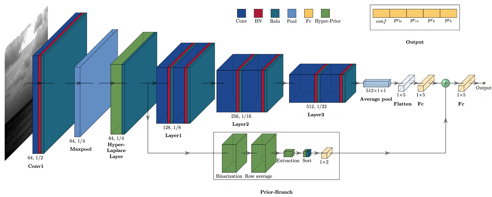
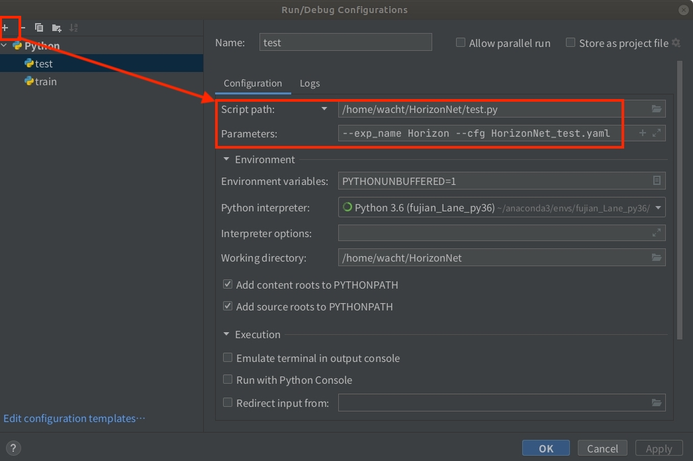

<div align="center">

# HorizonNet

</div>

## About this HorizonNet
HorizonNet is designed for horizon detection.
This code aims to reproduce the results of HorizonNet in our paper, hence part of the test data is included in ./data/test_set and 
the trained model from model_386 to model_416 is included in ./experiments/Horizon/models.

The framework of the project is based on [PolyLaneNet](https://github.com/lucastabelini/PolyLaneNet) from Lucas Tabelini for Lane detection (thanks for their outstanding work),
and changes have been made according to the characteristics and application fields of HorizonSet.
 
The main innovation point is that a new network structure was designed, which deeply fused the CNN and the thoughts of traditional hand-crafted features to improve detection efficiency.

Other contributions：

(1)Horizon detection attempts that are completely based on CNN structures.

(2)Self-built dataset named HorizonSet, which contains more than 6000 images with six sub-datasets under different scenes.

...

## About the dataset
HorizonSet was constructed according to the structure of the Tusimple dataset, for every horizon line, 13 gt points were provided.  
Part of the stage images processed by Prior-Branch are listed in ./images and ./images_binary, they represent the binarized 
feature maps and their corresponding average row grayscale images, respectively, you could acquire by yourself with the code
in ./nets/Proposed.

Part of the test images that are marked with gt and pred are also shown in ./Draw_images, you could draw these images via the annotated line in test.py.

## Run test.py to validate our model
To run the code you should first install the correct environment.

The whole project is based on Python 3 and PyTorch, the version we used is Python-3.6.13 and PyTorch-1.7.1, 
the project and other key packages could be downloaded and install by:

```
$ git clone https://github.com/weserubung/HorizonNet
$ cd HorizonNet
$ pip install -r requirements.txt
```

If your IDE is Pycharm, open the "Edit configuration" and set the parameters as follows:
```
--exp_name Horizon --cfg HorizonNet_test.yaml
```


And then you can run test.py through the YAML configuration file right in the folder of HorizonNet and wait for the results.

